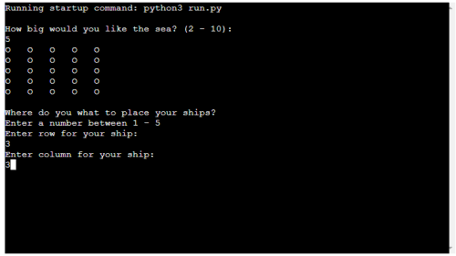

# Battleship

[Veiw the project here](https://love-battleship.herokuapp.com/)

## Table of contents
* [General Info & Purpose](#general-info)
* [How To Play](#how-to-play)
* [User Stories](#user-stories)
* [Features](#features)
* [Technologies And Data Model](#technologies-and-data-model)
* [Testing](#testing)
* [Deployment](#deployment)
* [Credit](#credit)

## General info

The purpose of this site is to create an easy and well-coded game in Python. The game is only coded in Python and created in GitPod. View my [GitHub](https://github.com/Linushf/battleships2). 

The game itself is a widely known game called "Battleship" and if you are not familiar with this game you can read about it on [Wikipedia](https://en.wikipedia.org/wiki/Battleship_(game))

Socially this game can be played by two users against the computer. It doesn't give the user a better chance of winning but it is always better to share fun and excitement.
This page is the third (out of five) milestone project to become a Full Stack Developer. The course is provided by [Code Institute](https://codeinstitute.net/).

## How to play

This game is very much like the game as we know it but it is played on one board only. You simply choose board size and where you want to place your ship and the game is on. The computer has also chosen a spot on the game board and the first one who fires at the other player's ship wins. The computer and player play on the same board and the battleships occupies one "O" on the board. On the game board a # = User ship location, X = User miss and * = Computer miss.

## User Stories

As a player, I want to initialize the game easily and be able to choose how quick one gameplay will be so this game is created so the user chooses how big the board will be. If the user chooses a 2x2 board it will only fit 2 empty spots and 2 ships so the game will be over after only one turn. If the user chooses 10x10 the board will hold 98 empty spots so the game can be played (up to) 48 turns.

## Features

### Existing Features

- __Opening question__

    The game starts with asking the user how big board they would like to play. If the user inputs a number that is not 2-10 an error message will appear and the user is asked again until a valid number is (2-10) is inserted.

    
- __Second question__

    In this picture, the user has entered "5" to the opening question so the code creates a 5x5 board to play. The user is asked to choose a row number (that is within the selected board size) to place their ship.

    

- __Third question__

    In this picture, the user has entered "5" to the opening question so the code creates a 5x5 board to play. The user is asked to choose a column number (that is within the selected board size) to place their ship.

    

- __Game board created__

    The ships are placed on the board and the user's ship is shown to the user. The computer has not, and cannot, picked the same spot as the user. Now the game is ready to play. The game is waiting for the user to input row and column and fire onto the board.

    

- __Gameplay__

    Now the user has shot 5 shots, row 1, all columns. The computer has shot at five random locations. No winner yet.

    

- __Game over__

    The user always has the first shot and this picture shows gameplay that lasted almost until the whole board was played. When either the user or computer wins the game will ask the user for a new game. If the user type in 'yes' the game will be played again. The code is created so it doesn't matter if the user typing capital letters or not.

    

### Future Features

- __Highscore board__

    To add more value to the user it would be cool to add a high score list. In that case, the user could submit their name and post/submit to the high scoreboard. The sooner the user finds an enemy ship the greater score.

- __Multiplayer__

    To make the players able to challenge their family, friends, and colleagues. Online or on the same device.

- __Bigger ships__

    The initial idea was to create ships in bigger sizes och the ability to place them on the board both horizontally and vertically but the time for this project has been too short but it is a feature that could easily be implemented. 

## Technologies and Data Model

- __Data Model__

    I decided to build this game with no global variables and only functions that work with each other. I find that this made it easy for me to locate errors writing this code. Every step of the game is represented by a function code and that takes value from the user, randomized computer decisions, and other functions. 

    All functions are represented in a main() function and it loops from the first question ("How big would you like the sea?") until a game is over and the user is asked if they want to play again. If the user typer in "No" the whole loop comes to an end but if the user answers "yes" the main() function is called again and the initial question will be asked again.  

- __Languages__

    - Python

- __Framework, Libaries & Programs Used__
    - Git
    - Github
    - Heroku

## Testing

- __I manually tested this code using following:__

    - My local python terminal installed on computer to create most of the code.
    - Tried to input failing values and errors appears as expected, the game does not crash.
    - [Pep8 online checker.](https://codeinstitute.net/) No errors returned when checking the code. 

        

- __Bugs__
    - When finishing this code I realized that if the user put in wrong value into the first question, the game asked again for correct value input but the following question, where to place the ship was asked: "Choose a row for your ship between 1 -0". I rewrote this particular code many times and the solution was simply to call the function again when the "if"-statement. 

    - When playing the game one bug I found was that it was possible to shoot at the same spot multiple times but not on the user's own ships and not on the same coordinates where the computer had already shot. This was easily solved by changing the "if/elif"-statements for user shots.

- __Remaining bugs__
    
    There is no bugs remaining.

- __Responsiveness__ 

    - At the top of this README.md a picture from "Am I Responsive" is provided. 

## Deployment

- __Gitpod__
    - The code to this project is created on GidPod and is readable on my GitHub page. [View the project here](https://linushf.github.io/battleship2/)

    - This project is deployed to Heroku and I deployed the project with these steps:
        - Setting up a Heroku account and creating a new application by clicking "create new app"-button on the start page.
        - In settings I clicked "cofig vars" and provided a key and a value provied by Code Institute.
        - In settings I also added some buildpacks, Python and NodeJS, in that exact order.
        - Link and connected the Heroku to my GitHub and the repository in which this is created.
        - Finally I clicked on "Enable Automatic Deploys" and "Deploy Branch".

## Credit
- __Code__
    - In the start-up process I watched a few tutorials on [YouTube](https://www.youtube.com/ "YouTube Video") for inspiration. One particular user I watched a lot to get ideas was a cannel called [Knowledge Mavens](https://www.youtube.com/channel/UC7CTkf5Za9VD6JU1C0ZXWlg "YouTube Channel") who has made a few tutorials on how to create battleship code in Python. I watched many other videos too but I found "Knowledge Mavens" to be the best teacher and I started by coding along with his videos.

- __Acknowledgement__
    - Code institute tutor service has helped me a lot when I was facing issues with coding and trying to solve bugs.
    - My mentor, Rohit Sharma, has been very helpful throughout the process of creating this project and we've had 3 mentor sessions.

Enjoy the game!
[See more of my work on GitHub](https://www.github.com/linushf)